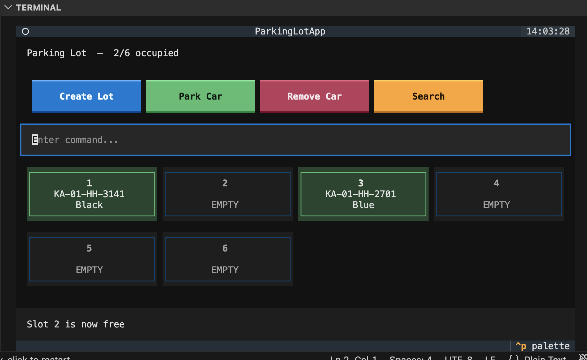

# Parking Lot

Automated ticketing system for a parking lot. Allocates nearest available slot on entry, frees it on exit. Supports queries by car color and registration number.

## Setup

```bash
bin/setup
```

## Usage

### CLI (interactive)
```bash
bin/parking_lot
```

### CLI (file input)
```bash
bin/parking_lot file_inputs.txt
```

### TUI
```bash
bin/parking_lot_tui
```



### Docker
```bash
docker build -t parking_lot .
docker run -it parking_lot                  # interactive
docker run -it parking_lot file_inputs.txt  # file input
```

## Commands

| Command | Example | Output |
|---------|---------|--------|
| `create_parking_lot <n>` | `create_parking_lot 6` | `Created a parking lot with 6 slots` |
| `park <reg_no> <color>` | `park KA-01-HH-1234 White` | `Allocated slot number: 1` |
| `leave <slot_no>` | `leave 4` | `Slot number 4 is free` |
| `registration_numbers_for_cars_with_colour <color>` | `registration_numbers_for_cars_with_colour White` | `KA-01-HH-1234, KA-01-HH-9999` |
| `slot_number_for_registration_number <reg_no>` | `slot_number_for_registration_number KA-01-HH-1234` | `1` |
| `slot_numbers_for_cars_with_colour <color>` | `slot_numbers_for_cars_with_colour White` | `1, 2` |

## Tests

```bash
pytest tests/ -v
```
